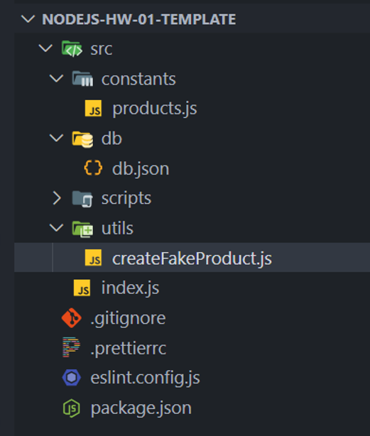

# Technical Assignment (TA)

## Preparatory Steps

1. Create a new team repository on **github.com**, and choose the **.gitignore (node)** template.

2. Clone the repository to your local computer.

3. Perform the initial project setup:
   - Create the `package.json` file using the command:

     ```bash
     npm init -y
     ```

   - Add the following property to `package.json`:

     ```json
     "type": "module"
     ```

     4. Install and configure ESLint:

   - Run the command:

     ```bash
     npm init @eslint/config@latest
     ```

   - In the `eslint.config.js` file, use the following content:

     ```js
     import globals from 'globals';
     import pluginJs from '@eslint/js';

     export default [
       pluginJs.configs.recommended,
       {
         files: ['src/**/*.js'],
         languageOptions: { globals: globals.node },
         rules: {
           semi: 'error',
           'no-unused-vars': 'off',
           'no-undef': 'error',
         },
       },
     ];
     ```

   ## Prettier Configuration

In the root of the project, create a `.prettierrc` file with the following content:

```json
{
  "semi": true,
  "singleQuote": true,
  "trailingComma": "all",
  "printWidth": 80
}
```

## Additional Steps

1. Make sure that the `.gitignore` file includes the `/node_modules` folder in its exclusions.

2. Install the `@faker-js/faker` package for generating mock data using: npm i -D @faker-js/faker

3. Create the project structure according to the provided example.  
   

4. In the file `src/constants/products.js`, declare the variable `PATH_DB`.  
   Initialize it with the path to the file `src/db/db.json`.

5. In the file `createFakeProduct.js`, add the following content:

```js
import { faker } from '@faker-js/faker';

export const createFakeProduct = () => ({
  name: faker.commerce.productName(),
  price: faker.commerce.price(),
  category: faker.commerce.department(),
  description: faker.commerce.productDescription(),
});
```

# Tasks

## Task 1

Create the file `src/scripts/generateProducts.js`.

In it, define the function `generateProducts`.  
It should use the `createFakeProduct` function to generate a given number of products, then add them to the array in the file `src/db/db.json` and write them back to the same file.

Add a `generate` script to `package.json` to run the code from `src/scripts/generateProducts.js`.

After running the `generate` script, make sure your `generateProducts` function correctly adds new products to the existing ones.

If the array was empty, after the function runs it should contain the specified number of products, e.g., 7.  
If there were 4 products and 7 more are generated, the total should be 11.

The file `src/db/db.json` should reflect these changes.

---

## Task 2

Create the file `src/scripts/getProductsByMinPrice.js`.

In it, define the function `getProductsByMinPrice`.  
It should accept a price value as a parameter and return an array of products from `src/db/db.json` whose price is equal to or greater than the given value.

Include logging of the function call result in this file.

Add a `get-products-by-min-price` script to `package.json` to run the code from `src/scripts/getProductsByMinPrice.js`.

After running the script, ensure your `getProductsByMinPrice` function works correctly.

---

## Task 3

Create the file `src/scripts/getTotalPrice.js`.

In it, define the function `getTotalPrice`.  
It should return the total price of all products in the array from `src/db/db.json`.

Include logging of the function call result in this file.

Add a `get-total-price` script to `package.json` to run the code from `src/scripts/getTotalPrice.js`.

After running the script, ensure your `getTotalPrice` function correctly calculates the total price of all products in the file.

---

## Task 4

Create the file `src/scripts/getUniqueCategories.js`.

In it, define the function `getUniqueCategories`.  
It should return an array of unique categories present in the product array from `src/db/db.json`.

Include logging of the function call result in this file.

Add a `get-unique-categories` script to `package.json` to run the code from `src/scripts/getUniqueCategories.js`.

After running the script, ensure your `getUniqueCategories` function correctly returns the unique categories from the product array.

---

## Task 5

Create the file `src/scripts/modifyProducts.js`.

In it, define the function `modifyProducts`.  
It should overwrite the contents of `src/db/db.json` so that the resulting file contains the same products but without the `description` field.

Add a `modify-products` script to `package.json` to run the code from `src/scripts/modifyProducts.js`.

After running the script, ensure your `modifyProducts` function correctly rewrites the file contents.

---

## Task 6

Create the file `src/scripts/groupProductsByCategories.js`.

In it, define the function `groupProductsByCategories`.  
It should return an object where product names are grouped by category.

The resulting object should have a structure similar to:

```js
{
  category1: [name1, name3, name5],
  category2: [name2, name7],
  category3: [name4, name6],
}
```

Add a `group-products` script to `package.json` to run the code from `src/scripts/groupProductsByCategories.js`.

After running the `group-products` script, make sure your `groupProductsByCategories` function correctly groups product names by category.

---

## Task 7\*

Create a `files` folder inside the `db` directory.

Create the file `src/scripts/createProductsFiles.js`.

In the file `src/constants/products.js`, declare the variable `PATH_FILES_DIR`.  
Initialize it with the path to the `files` folder.

In the file `src/scripts/createProductsFiles.js`, define the function `createProductsFiles`.  
It should create in the `files` folder as many files as there are products in the array from `src/db/db.json`.

Each file should contain the product object.

The filename should be the product name with each word separated by a hyphen and in `.json` format.  
For example: `luxurious-soft-soap.json`.

Add a `create-products-files` script to `package.json` to run the code from `src/scripts/createProductsFiles.js`.

After running the `create-products-files` script, make sure the expected files are created in the `files` folder.
